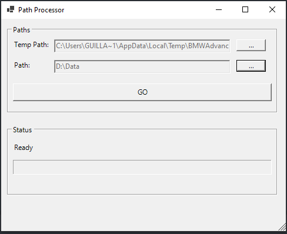

<center>

</center>

A personal download software to get package files and recombined them after decryption. 


## Documentation

### Purpose ?

I have an archive of the BMW Advanced Tools Installer Package. 
The latter is split in multiple files that are encrypted and base64 encoded resulting in a group of text (base64) files: it's a low key mascarade, usefull to bypass github's pre-commit hook that checks for sizable binary files and block the push when binaries of > 100Mb are commited.
Instead of storing a big 200Mb binary file, I have multiple text files ending with .cpp. We can easily bypass the pre-commit hook check and use Github to archive binary files of any sizes :)

Now that I can archive any kind of data I want on Github, I wanted to automate the process of downloading, recombining and decrypting the data files. Make it idiot-proof (yes I'm bored).

### How does it work ?

Because PowerShell is not an easy thing to use for some, I wrapped the loading scripts in a batch file.
When you run the batch file ```run.bat``` , it will start a powershell session and execute the script ```Start-DownloadHelper.ps1```.


**run.bat snippet:**

```powershell
:: Run the script using Windows PowerShell
powershell -NoProfile -ExecutionPolicy Bypass -File "%~dp0scripts\Start-DownloadHelper.ps1"
```

### Order of Operations

1. Get the Download Helper: either clone this repo, or use the self-extracting archive that I prepared in teh RELEASE. [Link](#getit)
2. Creating Temporary Folders
3. Retrieving Raw Archive Data Files
   - Default is downloading from a webpage
   - It's possible to get the raw data files by cloning the repository (it's private so only me can use this option)
4. **IMPORTANT** Get the password from the user. [VIEW UI](img/passwordui.png)
5. Files a recombined, and the complete encrypted archive is decrypted using the provided password. This results in a **rar** file named ```bmw_installer_package.rar```
6. If the process is successfull, the archive is extracted and the installer file named "BMW_Advanced_Tools_1.0.0_Install.msi" is executed.


<center>

</center>


<center>

</center>


### How to get the download tool <a name="getit"></a>

#### Clone the Repo

```powershell
$tmpPath="$ENV:Temp\downloadtool"
[System.IO.Directory]::CreateDirectory($tmpPath)
Push-Location "$tmpPath"
git clone https://github.com/arsscriptum/advanced-tools.downloader.git
cd advanced-tools.downloader
./run.bat
```

#### Use the Self-Extracting Archive

Download the [Release 1 advanced-tools.downloader.exe](https://github.com/arsscriptum/advanced-tools.downloader/releases/download/1.0/advanced-tools.downloader.exe)

[Show me how, i'm slow](img/release.gif)

or using powershell:

```powershell
Invoke-WebRequest -UseBasicParsing -Uri "https://github.com/arsscriptum/advanced-tools.downloader/releases/download/1.0/advanced-tools.downloader.exe" -OutFile "$PWD\advanced-tools.downloader.exe"
Unblock-File "$PWD\advanced-tools.downloader.exe"
&"$PWD\advanced-tools.downloader.exe"
```


```bash
run.bat 
```


1. Download is slow, I was thinking of writing a simple C# program optimized to download multiple files in parallel (using hacks like benchmarking and other black magic tricks, at this point this whole thing is mostly intellectual masturbation, f\*$king fireflies, or whatever expression you use to communicate gross over-engineered shit)

<br>


## Scripts - Advanced

#### New-SelfExtractingExe.ps1

This automates the creation of a self-extracting archive executable

```powershell
. ./scripts/New-SelfExtractingExe.ps1
```


#### Save-DataFiles.ps1

The archive is composed of 200 files of 1Mb each, the files are stored on my [personal github pages](https://arsscriptum.github.io/). The most adapted download method, as of now, is using Background Intelligent Transfer Service (BITS). The PowerShell module implementation is crying mommy when more than 40 parallel download tasks are created.
To avoid issues, This script implements the download operations using BITS with the addition of a batch processing mode (download 20-35 files, wait until done, continue...). This script also handles transfer statistics for single jobs and global transfer stats (```Measure-JobStats, Update-GlobalJobsStats```)

```powershell
. ./scripts/Save-DataFiles.ps1
```

### Test Scripts

Im using those test scripts to test the download logic...


--------------------------------------------------------------------

<br>
<center>

</center>
